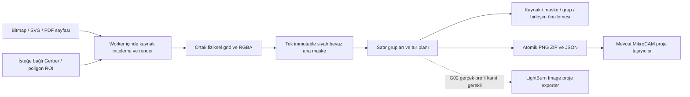

# Görsel interlace uygulama mimarisi

2026-10-02. Gerçek hedef: MikroCAM Evo, CPython 3.13, Windows 11. V1/V2 kodu mevcut;
V3 native exporter ve V4 native yürütümü henüz mevcut değildir.

## Veri akışı

Kaynak yalnız hazırlanırken rasterlenir. Yüklenen kaydın gömülü ana maskesi doğrulanıp
kullanılır; renderer değişince otomatik yeniden üretim yoktur. Export ve preview aynı
maske/grid/ayar/revizyon snapshot'ını kullanır. Her parça aynı W,H ve mm tuvalini taşır.

## Gerçek paket sınırları ve dosyalar

| Katman | Dosyalar / görev |
| --- | --- |
| `core` | `visual.py`: SourceInfo / SourceAsset / Grid / Frame / Mask; `interlace_job.py`: raster iş ve plan modelleri; `visual_normalize.py`: alpha/eşik; `visual_interlace.py`: satır üyeliği ve parite; `visual_preview.py`: bounded thumbnail; `geometry_visual.py`: ROI → SVG |
| `importers` | `visual_source.py`: stdlib dosya imzası dispatch |
| `laser` | `visual_plan.py`: tur/sıra/aktif geçiş/bekleme; `visual_recipe.py`: katı payload; `visual_files.py`: atomik yazım; `visual_recipe.schema.json`: şema 1 |
| `bridge` | `visual_bitmap.py`: Pillow ve ortak sampler; `visual_svg.py`/`visual_fonts.py`: resvg ve yerel font; `visual_png.py`: 1-bit codec; `visual_workflow.py`: detached orkestrasyon; `visual_recipe.py`: codec+JSON I/O; `visual_export.py`: PNG ZIP; `visual_geometry.py`/`visual_host.py`/`visual_project.py`: legacy sınırı |
| `ui` | `visual_worker.py`: QThread/cancel/revision; `visual_pdf.py`: lazy QtPdf; `visual_interlace_panel.py`: kontroller; `visual_preview.py`: fit/zoom; `visual_errors.py`: Türkçe hata karşılıkları |
| legacy | `appMain.py`: yalnız altı satır menü bağlantısı |

Import guard alan paketlerinde NumPy'ı da yasaklar. Diziler core'da, codec bağımlılıkları
bridge'de, bütün Qt kullanımı ui'de kalır. `importers` ile `laser` birbirini import etmez.
Yeni registry, ABC, FlatCAM nesne türü, ikinci Placement veya ikinci LaserRecipe yoktur.
Mevcut `laser/interlace.py` vektör algoritması aynen korunur.

## Grid ve dönüşüm

`pitch=25.4/dpi`; `W,H=ceil(mm/pitch)` hesabı Decimal ile yapılır. Padding sol üst
viewport'u esnetmez; dış piksel merkezleri inverse modunda da beyazdır. EXIF, bitmap
kırpma, saat yönü90° katları ve ayna bir kez uygulanır. UI90° dönüşte fiziksel W/H'yi
takas eder. SpinBox gösterimi yuvarlansa bile kayıtlı kesin ölçü/DPI değişmez.

Crop API bu sürümde yalnız bitmap'in EXIF sonrası piksel koordinatıdır. SVG/PDF'de
non-null crop açık `CROP_UNSUPPORTED` verir; bütün seçili sayfa renderlenir. İlk UI
kırpma kontrolü sunmaz. Gerber ROI ayrı, açık mm dikdörtgenidir. Bu sınır, render edilmiş
geçici piksel koordinatının SVG viewBox veya PDF point koordinatı sanılmasını önler.

## Kaynaklar ve bağımlılıklar

| Bağımlılık | Seçim / gerekçe / alternatif |
| --- | --- |
| Pillow | `12.3.0`; yaygın bitmapler ve 1-bit PNG; profil varsa sRGB, yoksa açık varsayım; 16-bit gri normalize edilir |
| resvg_py | `0.5.0`; statik SVG clipping/mask/stroke; ABI3 Windows wheel kuruldu. Explicit `dpi=96` belge birimlerini çözer; final kazıma DPI'ı508 gibi ayrı parametredir |
| QtPdf | Mevcut PyQt6/Qt 6.11; seçili sayfa görünümü, sayfa dönüşü ve boyutu; renderer worker thread'inde yaratılıp kapatılır |
| fontTools | Mevcut pinned fontTools; yerel font family/glyph incelemesi. Eksik font sessiz değiştirilmez |
| NumPy/Shapely | Mevcut pinler; yalnız izin verilen core/bridge sınırında |

Pillow ve resvg optional `requirements-visual.txt` içinde; mevcut image extra bu dosyayı
içerir. QtSvg clipping açısından daha dar; CairoSVG yeni native kurulum gerektirir.
İkinci renderer/fallback eklenmedi. QtPdf yoksa yalnız PDF hatası verilir; program açılır.
Wrapper MIT lisansı exact wheel/hash ile envanterdedir; Qt/PDFium/font bildirimleri
mevcut envanterde. 75 kilitli Rust crate notice dosyaları exact kaynak hash'leriyle korunur. Wheel build
provenance ve nihai bundle denetimi açık kalır; installer/release teslimi iddia edilmez.

## Worker, bellek ve iptal

Dosya read/decode/render/PNG/JSON yazımı QThread'dedir. Legacy nesne yayınlama yalnız
GUI thread'inde; worker'a detached bytes/poligon snapshot geçer. Yeni input revizyonu
artırıp eski işi iptal eder; geç biten sonuç kabul edilmez. Native renderer içinde zorla
thread termination yoktur; iptal stage aralarında görülür. Kapanış worker'ı bekler.

Kaynak64MiB, JSON256MiB, final40m piksel, Pillow çalışma belleği tahmini1GiB üst sınırdır.
SVG renderer tek kenarı32767'ye sınırlar. PDF128 sayfa ile sınırlandırılır. Ana maske ve
bir geçiş buffer'ı; N tam boyutlu görüntü bellekte tutulmaz. Preview≤1200 px thumbnail;
zoom bu thumbnail'ı büyütür, üretim bitmap'i preview'den türetilmez.

## Kayıt ve host

Şema1 JSON kaynak bytes + 1-bit ana maske + hash + preparation + grid + interlace +
effective_orders + mevcut Placement/Recipe + provenance içerir. Unknown keys, duplicate
keys, nonfinite sayılar, hatalı hash/boyut reddedilir. Eski **visual** payload'da interlace
veya count yoksa1; mevcut poligon LaserJob/CNC kayıtları dönüştürülmez.

Host, payload'ı çıktı üretmeyen mevcut Geometry `obj_options.mikrocam_visual_interlace`
alanında tutar. `solid_geometry=None`, plot=False, tools boş; yeni nesne türü yoktur.
Gerçek `.FlatPrj` save/reopen testi kaynak dosyaları silindikten sonra aynı maskeyi açar.
PNG ZIP grup-00..NN, job.json ve manifest içerir; native LightBurn ayarları uygulanmış
sayılmaz. Atomik yazım destination yanında unique temp + fsync + replace; iptal/eski
plan destination'ı değiştirmez.

## LightBurn kabul kapısı

[Native sözleşme](lightburn-contract.md) geçerlidir. Gerçek sürüm/device, saved fixtures,
bitmap encoding, placement, Pass-Through, sıra, white-row skip, kapasite ve direction
kanıtları olmadan XML schema tahmin edilmez. Şu anda native button açıklamalı kapalıdır.
Tur/bekleme isteği planda ve kayıtta korunur; PNG paketi bunları LightBurn'e uygulamaz.
Hareket süresi hesaplanmıyor: yalnız aktif satır/geçiş ve istenen dwell kesin hesaplanır.

## Constitution Check

| Soru | Sonuç |
| --- | --- |
| Yeni mantık doğru katmanda mı? | Evet; core NumPy, bridge codec, ui Qt; import guard koşusu gerekli |
| Legacy ≤50 satır ve yalnız bağlantı mı? | Evet; appMain +6 |
| Yeni soyutlama iki kullanım/bağımlılık gerekçe+pin+lisans? | ABC/registry yok; ortak codec JSON ve PNG paketinde; optional pins/notices kayıtlı |
| Birim/transform/recipe/schema tek kaynak mı? | Evet; mm + mevcut Placement/LaserRecipe + schema 1 |
| Test önce ve donanımsız mı? | Evet; core/alan headless; UI offscreen, native masaüstü ayrıca |
| Makine/lazer etkisi varsa stop/tehlike analizi? | N/A; yalnız dosya/CAM, port veya emisyon yok |
| Dış kaynak temiz oda/lisans izli mi? | Evet; kendi kod ve sentetik fixture; exact dependency notices, binary audit gap açık |
| Feature≤3 hikâye ve40 task mı? | Evet;032/033/034/035 her biri3 hikâye ve13/10/8/7 task |

Kasıtlı anayasa istisnası yoktur. Modül600/fonksiyon80 ve legacy bütçesi ölçülür.
Yanlış ölçek/ayna/negatif/tur sırası riski grid/hash/corner/roundtrip testleriyle sınanır.
Güç/hız tahmin edilmez; native exporter ileride kullanıcı recipe/template'ı gerektirir.
